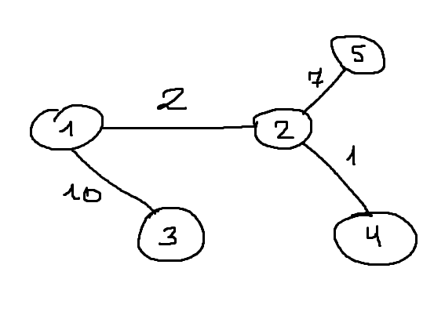

# Муравьиный алгоритм

Реализация муравьиного алгоритма с помощью асинхронного программирования

## Граф

Информация о графе хранится в `graph.txt`.<br>

Например, для графа, изображенного на рисунке, информация представлена в следующем виде:<br>
```
0 2 10 0 0
2 0 0 1 7
10 0 0 0 0
0 1 0 0 0
0 7 0 0 0
```
N-ая строка описывает N-ый город.